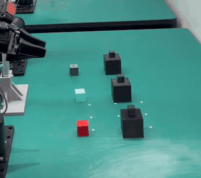
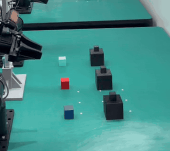
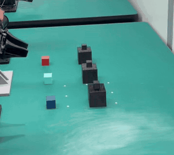
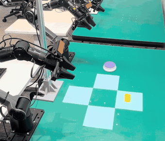
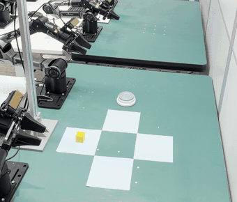
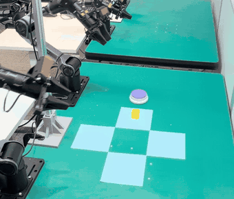
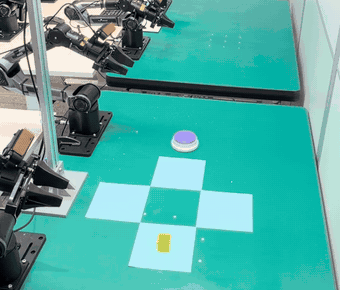
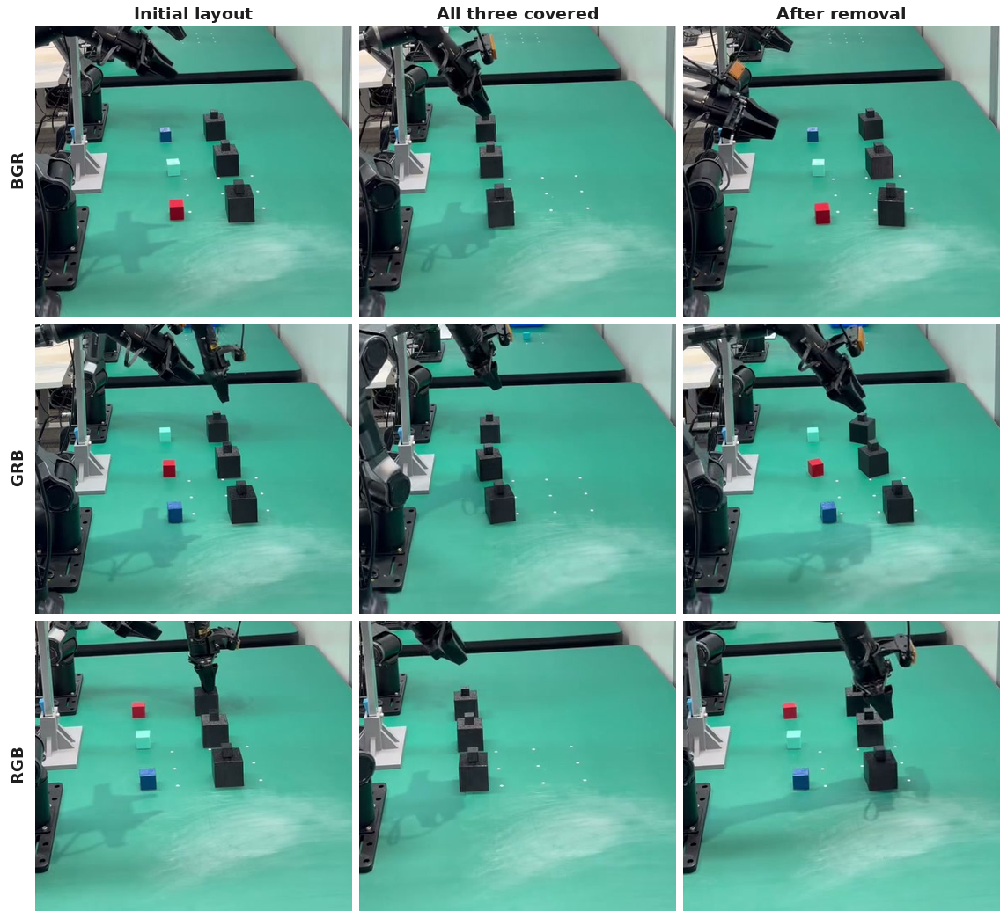
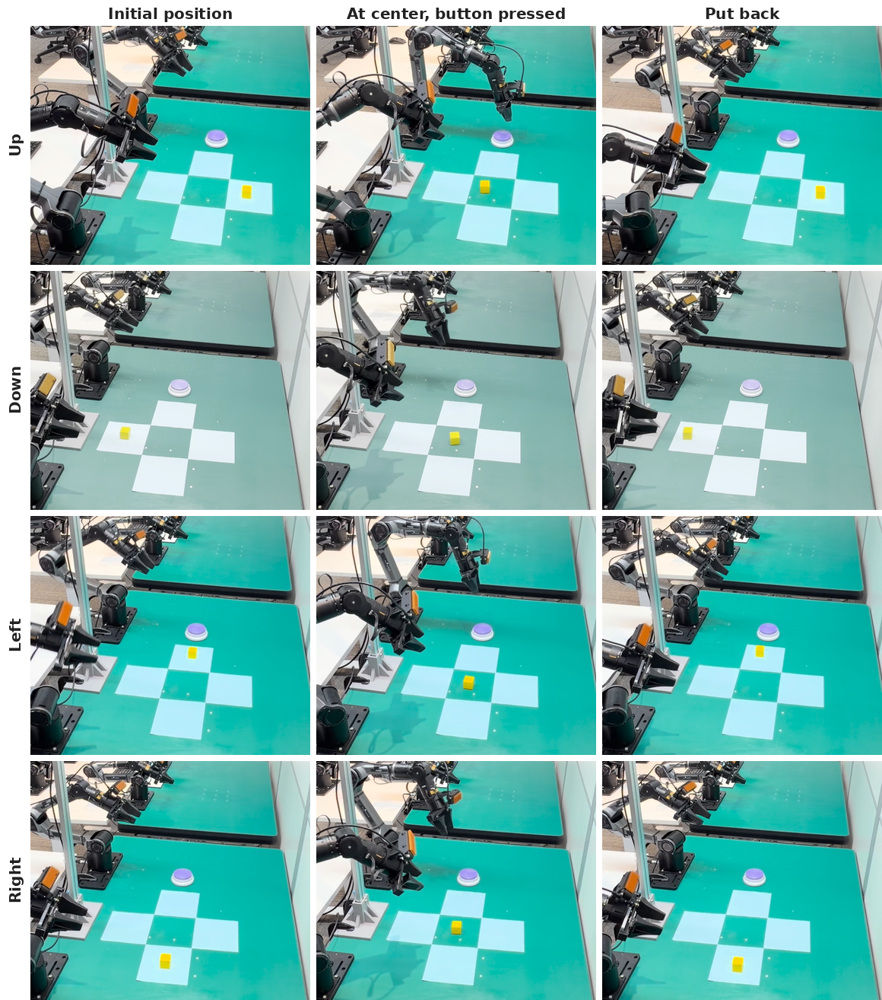

<div align="center">


</div>

<h1 align="center">🔥 SimpleMemVLA 🔥</h1>

<h3 align="center">A Simple but Effective Native-Video Memory for Vision-Language-Action Models</h3>

<div align="center">

[](https://arxiv.org/abs/2609.05533)
[](#-data--checkpoints)
[](#-data--checkpoints)
[](LICENSE)

</div>

<table align="center">
  <tr>
    <th colspan="3">Cover Blocks — take the lids off in red → green → blue order</th>
  </tr>
  <tr>
    <td align="center" width="33%">
      
    </td>
    <td align="center" width="33%">
      
    </td>
    <td align="center" width="33%">
      
    </td>
  </tr>
  <tr>
    <td align="center"><b>BGR</b> — blue, green, red</td>
    <td align="center"><b>GRB</b> — green, red, blue</td>
    <td align="center"><b>RGB</b> — red, green, blue</td>
  </tr>
</table>

<table align="center">
  <tr>
    <th colspan="4">Put Back Block — return the block to its initial mat after the button press</th>
  </tr>
  <tr>
    <td align="center" width="25%">
      
    </td>
    <td align="center" width="25%">
      
    </td>
    <td align="center" width="25%">
      
    </td>
    <td align="center" width="25%">
      
    </td>
  </tr>
  <tr>
    <td align="center"><b>Up</b></td>
    <td align="center"><b>Down</b></td>
    <td align="center"><b>Left</b></td>
    <td align="center"><b>Right</b></td>
  </tr>
</table>

<div align="center">

**SimpleMemVLA on a real dual-arm robot**, fine-tuned on 180 (Cover Blocks) and 308 (Put Back
Block) real-robot demonstrations. The lids must come off in **red → green → blue**,
yet all three lids look the same; the block must go back to the mat it started on, yet all four
mats are empty and identical while it waits at the center. Over 10 autonomous trials per initial
position the policy succeeds in **35/60 (58.3%)** on Cover Blocks and **28/40 (70.0%)** on Put
Back Block. The clips are successful rollouts, played 10x and 3x faster than the full recordings;
Cover Blocks labels list the block colors from far to near.

▶ **Full rollouts:** Cover Blocks [BGR](assets/real_robot_cover_blocks_bgr.mp4) ·
[GRB](assets/real_robot_cover_blocks_grb.mp4) · [RGB](assets/real_robot_cover_blocks_rgb.mp4)
&nbsp;|&nbsp; Put Back Block [Up](assets/real_robot_put_back_block_up.mp4) ·
[Down](assets/real_robot_put_back_block_down.mp4) ·
[Left](assets/real_robot_put_back_block_left.mp4) ·
[Right](assets/real_robot_put_back_block_right.mp4)
&nbsp;|&nbsp; [success rates and why both tasks need memory →](#-real-robot-deployment)

</div>

🔗 Quick Links
--------------

[🧠 Overview](#-overview) |
[✨ Highlights](#-highlights) |
[🏗️ Architecture](#%EF%B8%8F-architecture--streaming-inference) |
[📊 Results](#-results) |
[🤖 Benchmarks](#-supported-benchmarks) |
[🛠️ Setup](#%EF%B8%8F-setup) |
[💾 Data & Checkpoints](#-data--checkpoints) |
[🚀 Training](#-training) |
[🧪 Evaluation](#-evaluation) |
[🦾 Real Robot](#-real-robot-deployment) |
[🧩 Extending](#-extending-to-a-new-benchmark) |
[📄 Citation](#-citation)

📰 News
-------

* **[2026-09]** SimpleMemVLA fine-tuned on real-robot demonstrations and deployed on
  a real dual-arm robot for two memory tasks — *Cover Blocks* 35/60 (58.3%) and *Put Back Block*
  28/40 (70.0%), 10 autonomous trials per initial position
  ([🦾 Real-Robot Deployment](#-real-robot-deployment)).
* **[2026-09]** Preprint on arXiv: [arXiv:2609.05533](https://arxiv.org/abs/2609.05533)
  ([PDF](https://arxiv.org/pdf/2609.05533)).
* **[2026-08]** Initial release: paper, full training + closed-loop evaluation code for five
  benchmarks, LeRobot-v3 datasets and one released checkpoint per suite.

📝 TODO
-------

- [x] arXiv preprint release ([arXiv:2609.05533](https://arxiv.org/abs/2609.05533))
- [x] Real-robot deployment — *Cover Blocks* (58.3%) and *Put Back Block* (70.0%) on a dual-arm
      robot, 10 autonomous trials per initial position ([results](#-real-robot-deployment))

🧠 Overview
-----------

Long-horizon manipulation is partially observable: the information needed to choose the next
action may appear only in observations from minutes earlier. Existing memory mechanisms —
retrieval banks, learned compressors, recurrent states — must decide what to keep from the past
**before** knowing what a future decision will require (*write-time commitment*): a relevant
frame may be skipped by retrieval, visual detail lost in compression, earlier evidence
overwritten by a recurrent update.

Those designs were motivated by the assumption that minute-scale history is too large to
process directly — an assumption modern VLM backbones no longer make true. **SimpleMemVLA is a
VLA without a dedicated memory module**: it keeps the sampled history intact, presents it in
the timestamped video format the backbone was pretrained to process, and defers evidence
selection to native self-attention at decision time. The hidden states of a generated
**sub-task** then form the only channel from history to a standard flow-matching action head,
and shared-prefix prefilling keeps decision latency close to a single-frame VLA.

<div align="center">
<a href="assets/fig_taxonomy.png"></a>

*Prior memory designs insert dedicated machinery between the observation stream and the policy —
SimpleMemVLA feeds the timestamped stream directly as native context. A 60 s history uses only
~5.6k of a 262k-token context window, which can hold roughly 45 minutes.*
</div>

✨ Highlights
------------

* **🥇 State of the art on four memory benchmarks, one model per suite** — RMBench **94.0**
  (+11.0 over per-task specialists), RoboMME **88.3** (+43.7, above the ground-truth-perception
  oracle), MIKASA-Robo **74.0** (+29.6 over the best prior VLA), RoboMemArena **63.6 TSR**
  (+17.4, above the benchmark's own GT reference) — with **no cost on general-purpose
  control**: 97.5 on LIBERO (ties the best reported average) and the strongest zero-shot
  transfer to LIBERO-Plus (78.4).
* **🧲 The gain is the memory interface, not the backbone** — rebuilding retrieval, token
  compression and recurrent state on the *same* backbone, data and trainer reaches only
  31.5 / 22.6 / 20.6 on RoboMME vs 88.3 for native context.
* **⚡ Exact streaming inference** — the shared history prefix is prefilled while the robot
  executes the current chunk; decision latency drops **1.02 s → 0.68 s** with byte-identical
  outputs.
* **🧰 One repo, five benchmarks** — one model, one data pipeline, one trainer; everything
  benchmark-specific is a small spec module under
  [`simplememvla/benchmarks/`](simplememvla/benchmarks/).

🏗️ Architecture & Streaming Inference
--------------------------------------

<div align="center">
<a href="assets/fig_arch_stream.png"></a>
</div>

Only standard VLA components; self-attention over plaintext-timestamped history serves as
memory.

1. **History as native video.** At every decision the policy rebuilds a window over the last
   `history_video_sec` seconds, subsampled at `history_video_fps` from the native control-rate
   stream. The main camera's clip enters the Qwen3.5-4B backbone through its video channel —
   the processor prefixes every 2-frame temporal patch with a plaintext `<X.X seconds>`
   timestamp, exactly as in video pretraining. Wrist cameras contribute only their current
   frame through the image channel, so the input format itself separates past from present.
   The window is a *cap*, not a fixed length: young rollouts feed only their real frames,
   cropped/padded by one shared even-length rule
   ([`simplememvla/data/messages.py`](simplememvla/data/messages.py) `variable_history_frames`)
   used byte-identically by the training dataset and every rollout policy.
2. **A narrow text channel from history to action.** The backbone is supervised (token-level
   cross-entropy) to state the current **sub-task** as an ordinary assistant answer — no
   chain-of-thought, capped at 64 tokens. The hidden states and token embeddings of that span,
   plus one normalized proprio token, are the *only* conditioning a DiT flow-matching expert
   (~0.9B params) receives. The same span mask
   (`simplememvla.data.collator.subtask_span_mask`) selects the supervised tokens at training
   and the generated tokens at inference, so train/rollout conditioning can never drift.
   Deployment integrates the learned velocity field with 10 deterministic Euler steps, executes
   the first `execute_horizon` actions of the chunk, and re-decides (receding horizon).
3. **Exact streaming deployment.** Consecutive decisions share nearly their entire video
   prefix, so it is prefilled during action execution (per-temporal-patch ViT feature cache +
   KV-prefix reuse) and only the newly arrived patch, wrist frames and text stay on the
   critical path. Outputs are exactly those of full recomputation — all reported evaluations
   run this path.

Every prompt/pipeline detail an eval policy needs (cameras, window, fps, robot tag, control
frequency, sub-task column, variable-history flag) is persisted into the checkpoint's
`config.json`, so closed-loop evaluation rebuilds a byte-identical pipeline from the checkpoint
alone.

<div align="center">
<a href="assets/fig_latency.png"></a>

*Streaming keeps at-decision latency near the single-frame cost across 15 s – 45 min
histories (one H100, bf16, batch 1). At 60 s, streaming reduces latency from 1.02 s to
0.68 s, below the 0.96 s real-time budget of a 16-step chunk at 20 Hz.*
</div>

📊 Results
----------

<div align="center">
<a href="assets/fig_suites.png"></a>
</div>

One model per suite, closed-loop evaluation under each benchmark's official protocol
(per-task tables in the [paper](https://arxiv.org/abs/2609.05533)):

| Suite | Protocol | SimpleMemVLA | Best prior |
|---|---|---|---|
| **RMBench** (memory, bimanual) | 9 tasks w/ published baselines, 100 seeds/task | **94.0** | 83.0 (MemoryWAM, per-task specialists) |
| **RoboMME** (memory) | 16 tasks, 50 episodes/task | **88.3** | +43.7 over best non-oracle; above the 84.1 GT-perception oracle |
| **MIKASA-Robo** (memory) | 5 tasks, 100 episodes/task | **74.0** | 44.4 (MemoryVLA++); 67.8 (GMP, per-task non-VLA) |
| **RoboMemArena** (memory, >1k-step episodes) | 26 tasks, 51 trials/task, TSR / CSR | **63.6 / 72.1** | 46.2 / 63.9 (FrameSamp+Modul); 46.1 TSR (GT oracle) |
| **LIBERO** (general-purpose control) | 4 suites, 500 trials/suite | **97.5** | 97.5 (tie, RIPT-VLA) |
| **LIBERO-Plus** (zero-shot robustness) | 10,030 perturbed tasks, trained on LIBERO only | **78.4** | 73.1 (MemoryVLA++) |

**Isolating the memory interface.** Holding the backbone, data, sub-task supervision, action
head and optimizer fixed and swapping only how history reaches the model, native video context
reaches **88.3%** on RoboMME while matched retrieval, token-compression and recurrent-state
variants reach 31.5%, 22.6% and 20.6% — the bottleneck is *when* those mechanisms commit
information, not how accurately they do so.

<div align="center">
<a href="assets/fig_variants.png"></a>

*Task-level effects of restricted memory interfaces on RoboMME: retrieval, token compression
and recurrent state retain at most 79%, 96% and 58% of native-context performance, with the
token-compression peak confined to a single counting task.*
</div>

**Does the policy really read its history?** Holding the current observation and policy
fixed, removing or counterfactually replacing evidence in earlier frames redirects the
output across all suites, whereas masking an irrelevant segment does not — and the policy
adapts to edited or previously unseen visual histories without parameter updates, a form of
visual in-context learning:

<div align="center">
<a href="assets/fig_interv_timelines.png"></a>

*History interventions. Rows show histories from oldest to most recent, processed through
the unchanged deployment pipeline: orange borders mark evidence frames, gray fills evidence
ablations, and each row lists the resulting sub-task / action outcome.*
</div>

**Ablations.** Native-context memory relies on retained temporal evidence and on the
contextual hidden states of the sub-task span — shrinking the window ablates exactly the
behaviors whose evidence leaves it, shuffling frame order or removing plaintext timestamps
breaks temporally grounded tasks, and dropping either the hidden-state or token-embedding
input to the action head degrades control:

<div align="center">
<a href="assets/fig_ablations.png"></a>
</div>

<details>
<summary><b>📈 Per-task RoboMME breakdown (16 tasks, 24 methods)</b></summary>

<div align="center">
<a href="assets/robomme_simplememvla_position_by_task.png"></a>

*First on all sixteen RoboMME tasks among the 21 deployable methods. Boxes show the
interquartile range of the ranked pool; orange diamonds are SimpleMemVLA.*

<a href="assets/robomme_representative_methods_by_task.png"></a>

*Task-wise success rates for representative methods, grouped into Counting, Permanence,
Reference and Imitation.*

<a href="assets/robomme_all_methods_by_task.png"></a>

*Complete task-wise success rates for all 24 rows; colors encode memory families, the
orange hatched bar is SimpleMemVLA.*
</div>

</details>

<details>
<summary><b>🌀 Appendix: a sliding-window-attention (SWA) variant for unbounded streams</b></summary>

As a step toward continual inference over native video streams of unbounded duration, the
paper's Appendix E explores a variant trained with sliding-window attention: the context and
KV cache stay bounded as the stream grows, with episode-absolute timestamps keeping cached
patches immutable.

<div align="center">
<a href="assets/fig_swa_method.png"></a>

<a href="assets/fig_swa_cost.png"></a>

*The whole SWA decision takes 0.92 s on the longest RMBench episode — inside the 0.96 s
real-time budget with no background work left over.*
</div>

</details>

🤖 Supported Benchmarks
-----------------------

| Benchmark | Simulator | Robot | Action (d<sub>a</sub>) | Window T<sub>w</sub> | Rate f<sub>v</sub> | Frames K / stride s | Horizon H | Dataset (LeRobot v3) |
|---|---|---|---|---|---|---|---|---|
| **RMBench** | RoboTwin 2.0 / SAPIEN | Aloha-AgileX, bimanual | 14-D joint | 60 s | 2 fps | 120 / 8 | 30 | [`rmbench_lerobot`](https://huggingface.co/datasets/yinchenghust/rmbench_lerobot) |
| **RoboMME** | ManiSkill3 / SAPIEN | Panda | 8-D joint (`pd_joint_pos`) | 60 s | 2 fps | 120 / 10 | 30 | [`robomme_lerobot`](https://huggingface.co/datasets/yinchenghust/robomme_lerobot) |
| **MIKASA-Robo** | ManiSkill3 / SAPIEN | Panda (wristcam) | 8-D joint (`pd_joint_pos`) | 3 s | 20 fps | 60 / 1 | 16 | [`mikasa_lerobot`](https://huggingface.co/datasets/yinchenghust/mikasa_lerobot) |
| **RoboMemArena** | LIBERO fork / robosuite / MuJoCo | Franka Panda | 7-D OSC_POSE delta | 126 s | 1 fps | 126 / 20 | 16 | [`robomemarena_lerobot`](https://huggingface.co/datasets/yinchenghust/robomemarena_lerobot) |
| **LIBERO** | robosuite / MuJoCo | Franka Panda | 7-D OSC_POSE delta | 30 s | 2 fps | 60 / 10 | 16 | [`libero_lerobot`](https://huggingface.co/datasets/yinchenghust/libero_lerobot) |

Everything else about the method is identical across suites: embodiment-specific choices enter
only through this configuration tuple. Moving between bimanual and single-arm platforms
changes the configuration, not the mechanism.

<details>
<summary><b>📁 Repository layout</b></summary>

```
train.py                      # unified SFT entry point (--benchmark rmbench|robomme|mikasa|robomemarena|libero)
configs/
  sft_params.py               # Model/Data/Training arguments (benchmark-agnostic; specs fill defaults)
  zero2.json ...              # DeepSpeed configs
simplememvla/                 # core package
  benchmarks/                 # per-benchmark specs (dims, cameras, rates, dataset defaults)
  model/                      # SimpleMemVLAConfig, SimpleMemVLAForActionPrediction, DiT action head
  data/                       # LeRobot-backed dataset, collator, prompt builder, normalizer, augmentation
  training/                   # trainer (split LRs, deterministic LR schedule, NaN guards) + runner
  compat.py                   # torch 2.4.1 <-> fla/transformers compat shim
lerobot/                      # vendored LeRobot v0.5.1 (dataset codebase v3.0) + py3.10 patch
rmbench_sim/                  # RMBench closed-loop eval (+ vendored RoboTwin 2.0 benchmark code)
robomme_sim/                  # RoboMME closed-loop eval (+ vendored benchmark envs + frozen episode metadata)
mikasa_sim/                   # MIKASA-Robo closed-loop eval (benchmark vendored at third_party/MIKASA-Robo)
robomemarena_sim/             # RoboMemArena closed-loop eval (official scorers vendored at evaluation_benchmark/)
libero_sim/                   # LIBERO closed-loop eval (LIBERO cloned by the install script)
scripts/
  train.sh                    # bash scripts/train.sh <benchmark>
  eval_<benchmark>.sh         # closed-loop success-rate eval per benchmark
  eval_<benchmark>_openloop.sh# open-loop (dataset replay) action-L1 + sub-task accuracy
  precollect_rmbench_seeds.sh # RMBench expert-solvable seed cache (a cache is already shipped)
  install/                    # per-benchmark simulator installers + fast-path kernel builder
```

Each `*_sim` package contains the benchmark's train-consistent rollout policy (`policy.py`),
the closed-loop driver (`eval_success.py`), and simulator glue. Vendored benchmark code is
kept byte-faithful to the upstream benchmarks.

</details>

🛠️ Setup
---------

Python 3.10, CUDA GPU. The whole stack is pinned to **torch 2.4.1 / numpy < 2** because the
SAPIEN-based simulators require it; `transformers >= 5.11` (Qwen3.5) runs on torch 2.4.1
through a tiny compat shim every entry point applies automatically.

> **One conda env per benchmark family.** RMBench + MIKASA-Robo need `sapien==3.0.0b1`
> (beta), RoboMME needs stable `sapien 3.0.x` — these conflict. RoboMemArena/LIBERO
> (MuJoCo/robosuite) have no SAPIEN dependency. A clean recipe is one env per benchmark.

```bash
# 1) core env (repeat per benchmark, e.g. simplememvla-rmbench, simplememvla-libero, ...)
conda create -n simplememvla-<benchmark> python=3.10 -y
conda activate simplememvla-<benchmark>
pip install -r requirements.txt

# 2) fast-path kernels: flash-attn (required — the default attention backend for
#    train AND eval) + flash-linear-attention + causal-conv1d (required for training,
#    optional for eval). Needs nvcc for causal-conv1d.
bash scripts/install/install_fast_path.sh

# 3) the benchmark's simulator stack
bash scripts/install/install_rmbench_sim.sh        # SAPIEN deps + assets/CuRobo from ModelScope
bash scripts/install/install_robomme_sim.sh        # clones pinned ManiSkill fork -> third_party/
bash scripts/install/install_mikasa_sim.sh         # mani_skill 3.0.0b15 + vendored MIKASA-Robo + YCB assets
bash scripts/install/install_robomemarena_sim.sh   # robosuite/mujoco pins + LIBERO fork -> evaluation_benchmark/
bash scripts/install/install_libero_sim.sh         # robosuite/mujoco pins + clones LIBERO -> third_party/
# SAPIEN headless rendering additionally needs the Vulkan loader:
conda install -c conda-forge libvulkan-loader -y   # RMBench / RoboMME / MIKASA envs only
```

Nothing needs to be downloaded to browse or extend the code; datasets/assets are only needed to
actually train or roll out.

💾 Data & Checkpoints
---------------------

**Backbone**: [Qwen3.5-4B](https://huggingface.co/Qwen/Qwen3.5-4B). The training script
defaults to the hub id `Qwen/Qwen3.5-4B`; set `BACKBONE=/path/to/Qwen3.5-4B` for a local copy.

**Released checkpoints** — one per suite, self-contained (weights + `config.json` +
processor/tokenizer + `stats.json`), mirrored on both hubs:

| Suite | Hugging Face | ModelScope |
|---|---|---|
| RMBench | [`simplememvla_rmbench`](https://huggingface.co/yinchenghust/simplememvla_rmbench) | [`simplememvla_rmbench`](https://modelscope.cn/models/keithyc/simplememvla_rmbench) |
| RoboMME | [`simplememvla_robomme`](https://huggingface.co/yinchenghust/simplememvla_robomme) | [`simplememvla_robomme`](https://modelscope.cn/models/keithyc/simplememvla_robomme) |
| MIKASA-Robo | [`simplememvla_mikasa`](https://huggingface.co/yinchenghust/simplememvla_mikasa) | [`simplememvla_mikasa`](https://modelscope.cn/models/keithyc/simplememvla_mikasa) |
| RoboMemArena | [`simplememvla_robomemarena`](https://huggingface.co/yinchenghust/simplememvla_robomemarena) | [`simplememvla_robomemarena`](https://modelscope.cn/models/keithyc/simplememvla_robomemarena) |
| LIBERO | [`simplememvla_libero`](https://huggingface.co/yinchenghust/simplememvla_libero) | [`simplememvla_libero`](https://modelscope.cn/models/keithyc/simplememvla_libero) |

```bash
# Hugging Face
huggingface-cli download yinchenghust/simplememvla_rmbench \
  --local-dir checkpoints/simplememvla_rmbench
# or ModelScope
modelscope download --model keithyc/simplememvla_rmbench \
  --local_dir checkpoints/simplememvla_rmbench
```

**Training datasets** — LeRobot v3, expected under `data/datasets/<repo_id>` (the default
`--root`). Each carries the per-frame `subtask` supervision natively (`subtask_index` +
`meta/subtasks.parquet`) along with MEAN_STD normalization stats in `meta/stats.json`:

| Suite | Hugging Face | Size |
|---|---|---|
| RMBench | [`rmbench_lerobot`](https://huggingface.co/datasets/yinchenghust/rmbench_lerobot) | 1.6 GB |
| RoboMME | [`robomme_lerobot`](https://huggingface.co/datasets/yinchenghust/robomme_lerobot) | 9.7 GB |
| MIKASA-Robo | [`mikasa_lerobot`](https://huggingface.co/datasets/yinchenghust/mikasa_lerobot) | 0.3 GB |
| RoboMemArena | [`robomemarena_lerobot`](https://huggingface.co/datasets/yinchenghust/robomemarena_lerobot) | 14.0 GB |
| LIBERO | [`libero_lerobot`](https://huggingface.co/datasets/yinchenghust/libero_lerobot) | 51.4 GB |

```bash
huggingface-cli download yinchenghust/libero_lerobot --repo-type dataset \
  --local-dir data/datasets/yinchenghust/libero_lerobot
```

**Simulator assets** — RMBench's SAPIEN assets + CuRobo are pulled from ModelScope by
[`scripts/install/install_rmbench_sim.sh`](scripts/install/install_rmbench_sim.sh):
[`keithyc/RMBench_sim`](https://modelscope.cn/datasets/keithyc/RMBench_sim) (1.5 GB).

🚀 Training
-----------

```bash
conda activate simplememvla-<benchmark>
bash scripts/train.sh rmbench        # or robomme | mikasa | robomemarena | libero
```

`scripts/train.sh` reproduces each benchmark's published recipe: every dataset/pipeline
default (cameras, history window, variable-history, augmentation, sub-task supervision
column) comes from the benchmark spec, and the script sets only launch/optimization knobs.
Everything is env-overridable:

```bash
# fewer GPUs / smaller batch
GPUS_PER_NODE=4 PER_DEVICE_BATCH=4 GRAD_ACCUM=2 bash scripts/train.sh libero

# a custom history window
HISTORY_VIDEO_SEC=30 HISTORY_VIDEO_FPS=2 bash scripts/train.sh rmbench

# resume the latest checkpoint automatically (safe for auto-restarting jobs)
RESUME=auto bash scripts/train.sh robomme
```

Notes:

* Optimizer: AdamW with split learning rates for the backbone and the action head, 1000-step
  warmup + cosine decay, driven deterministically from `global_step` (robust under multi-node
  DeepSpeed scheduler-stepping quirks). DeepSpeed ZeRO-2 by default (`configs/zero2.json`);
  use `configs/zero2_offload.json` / `zero3_offload.json` on small GPU counts.
* The published step budgets assume a large multi-node global batch (~512); scale `MAX_STEPS`
  up on a single node.
* The trainer copies the dataset's `meta/stats.json` into every checkpoint as `stats.json` —
  evaluation needs it.
* Training only needs the *training* deps + fast-path kernels; simulators are not imported.

🧪 Evaluation
-------------

Each benchmark has a single script that runs the official closed-loop protocol end to end and
writes a run directory under `logs/` with a tee'd log, per-task/episode JSON and a summary:

```bash
conda activate simplememvla-<benchmark>

# RMBench: 10 tasks x 100 held-out expert-solvable seeds, batched SAPIEN group rollout
CHECKPOINT=checkpoints/simplememvla_rmbench NUM_GPUS=8 GPUS=0,1,2,3,4,5,6,7 \
  bash scripts/eval_rmbench.sh

# RoboMME: 16 tasks x 50 frozen test episodes (conditioning demo replayed inside reset)
CHECKPOINT=checkpoints/simplememvla_robomme NUM_GPUS=8 GPUS=0,1,2,3,4,5,6,7 \
  bash scripts/eval_robomme.sh

# MIKASA-Robo: 5 tasks x 100 canonical seeds
CHECKPOINT=checkpoints/simplememvla_mikasa NUM_GPUS=8 GPUS=0,1,2,3,4,5,6,7 \
  bash scripts/eval_mikasa.sh

# RoboMemArena: 26 memory tasks x 51 trials, official CSR/TSR scorers
bash scripts/eval_robomemarena.sh checkpoints/simplememvla_robomemarena
python -m robomemarena_sim.report_by_category <out-root>   # per-category table

# LIBERO: 4 suites x 10 tasks x 50 frozen init states
CHECKPOINT=checkpoints/simplememvla_libero \
  TASK_SUITES="libero_10 libero_goal libero_object libero_spatial" \
  bash scripts/eval_libero.sh
```

Common knobs (all env vars): `EXECUTE_HORIZON` (receding horizon), `NUM_DENOISING_STEPS`
(default 10), `GROUP_SIZE` (envs batched into one forward, where supported), `NUM_GPUS`/`GPUS`
(sharded workers), `VIDEO_DIR` / `SAVE_VIDEOS` (rollout videos), `ATTN_IMPLEMENTATION=sdpa`
(only on hosts without flash-attn). Smoke-test example:

```bash
TASKS=observe_and_pickup SEEDS_PER_TASK=2 GROUP_SIZE=2 \
  CHECKPOINT=checkpoints/simplememvla_rmbench bash scripts/eval_rmbench.sh
```

A checkpoint directory is self-contained: the eval stacks rebuild the exact training-time
pipeline (history window, stride, timestamps, cameras, prompt) from `config.json` alone —
there are no eval-side pipeline flags to keep in sync.

**Open-loop evaluation (no simulator)** — a fast proxy metric on the dataset itself
(action L1 in raw action space + sub-task exact-match accuracy):

```bash
CHECKPOINT=<ckpt> bash scripts/eval_rmbench_openloop.sh      # likewise robomme/mikasa/libero
```

🦾 Real-Robot Deployment
------------------------

Every number above comes from a simulator this repository also trains in. Here SimpleMemVLA is
fine-tuned on real-robot demonstrations — 180 for Cover Blocks, 308 for Put Back
Block — and then deployed on a real dual-arm robot, where it runs autonomously. Both are table-top
tasks that turn on something the table stops showing, and each is scored over 10 autonomous
trials per initial position.

**Cover Blocks.** Three colored blocks (red, green — a pale mint — and blue) stand in a row beside
three identical black lids. The robot covers every block with a lid, then has to take the lids
off in red → green → blue order. An initial position is named by the block colors from far to
near as seen from the camera (top to bottom of the frame), so **BGR** puts blue farthest and red
nearest; the six columns below are the six orderings of the three colors. Policy fine-tuned on
180 real-robot demonstrations, 10 autonomous trials per initial position:

| Initial position | RGB | GRB | GBR | RBG | BRG | BGR | Overall |
|---|---|---|---|---|---|---|---|
| Success | 8/10 | 6/10 | 7/10 | 6/10 | 5/10 | 3/10 | **35/60 = 58.3%** |

**Why Cover Blocks needs memory.** In the recordings every lid is in place before the first one
comes off: at that decision no color is visible anywhere on the table, and no block is ever
displaced, so the color-to-position binding survives only in frames from earlier in the episode —
the first block covered waits 52 s – 98 s for its turn. A policy reading only the current
observation sees three identical black lids. A fixed removal routine, taking the same seats in the
same order every time, yields red → green → blue from only one of the six initial positions; the
policy succeeds from all six.

The three recordings are successful rollouts from three of the six initial positions. In all
three the robot places the lids far to near, while the removal order follows no fixed direction
along the row, so a spatial habit — always near to far, always the same seat in the row — has to
be wrong in at least one of them.

| Recording | Layout, far → near | Lids placed | Lids removed | Removal order equals |
|---|---|---|---|---|
| **BGR** (131 s) | blue, green, red | far → near | red → green → blue | placement reversed; near → far |
| **GRB** (137 s) | green, red, blue | far → near | red → green → blue | *neither* — middle, far, near |
| **RGB** (126 s) | red, green, blue | far → near | red → green → blue | placement; far → near |

GRB carries the argument. There the required color order is neither the placement order nor its
reverse, and as a path across the table it runs middle, far, near — so it is not produced by
replaying the placement sequence, by playing it backwards, or by sweeping the row in either
direction. BGR and RGB, taken alone, would not separate such a shortcut from reading the history:
BGR removes in exactly the reverse of the order the lids went down, RGB repeats that order, and in
both the colors already lie red, green, blue along the row — near to far in BGR, far to near in
RGB.

<div align="center">
<a href="assets/fig_real_robot_cover_blocks.png"></a>

*The three Cover Blocks recordings (rows BGR, GRB, RGB; 131 s / 137 s / 126 s) frozen at three
moments each: the initial layout, all three blocks hidden under their lids, and the table once the
lids come off. No block is repositioned, so every reveal is a lid moving, not a block. The GIFs at
the top are cropped from these recordings and play at 10x.*
</div>

**Put Back Block.** A yellow block starts on one of four identical white paper mats laid out as a
plus around a bare green center square, with a round button just beyond the plus. The robot moves
the block to the center and presses the button, then has to put the block back on the mat it
started from. The initial position names that mat as on a top-down map with the robot along the
bottom edge: **Up** is the mat farthest from the arm bases, **Down** the nearest, **Left** the one
beside the button and **Right** the one nearest the camera. Policy fine-tuned on 308
real-robot demonstrations, 10 autonomous trials per initial position:

| Initial position | Up | Down | Left | Right | Overall |
|---|---|---|---|---|---|
| Success | 7/10 | 9/10 | 4/10 | 8/10 | **28/40 = 70.0%** |

**Why Put Back Block needs memory.** In each recording one arm carries the block and the other
presses the button. The original mat stays empty from the moment the block is lifted until it is
set back — more than half of the recording — and while the block waits at the center through the
button press, all four mats are empty and look the same: no mat moves and nothing is left on the
one the block came from. When the arm returns for the block, the mats no longer show where it
started; earlier frames do. Putting the block back on the same mat every time would succeed from
only one of the four initial positions; the policy succeeds from all four, and each of the four
recordings, one per initial position, returns the block to its own mat.

<div align="center">
<a href="assets/fig_real_robot_put_back_block.png"></a>

*The four Put Back Block recordings, one row per initial position (Up, Down, Left, Right), frozen
at three moments each: the block on its initial mat, the block at the center after the button
press, and the block put back. In the middle column all four mats are empty in every row. The GIFs
at the top are cropped from these recordings and play at 3x.*
</div>

🧩 Extending to a New Benchmark
-------------------------------

1. Add `simplememvla/benchmarks/<name>.py` with the configuration tuple (cameras, window,
   rate, horizon, dims) + a `BenchmarkSpec` (register it in
   `simplememvla/benchmarks/__init__.py`). Training works immediately:
   `bash scripts/train.sh <name>`.
2. Convert your data to LeRobot v3 with `task`, per-frame `subtask` (via `subtask_index` +
   `meta/subtasks.parquet`), `action`, `observation.state`, camera videos, and MEAN_STD stats
   in `meta/stats.json`.
3. For closed-loop eval, add a `<name>_sim/` package: a rollout policy that (a) calls
   `observe()` on every native control step, (b) reproduces the history clip via the shared
   `derive_video_sampling` / `variable_history_frames` helpers, and (c) two-stage decodes
   (generate sub-task → `predict_action` on the sub-task span). The five existing packages
   are working references, from single-env adapters (`robomemarena_sim`) to batched group
   rollout (`rmbench_sim`).

🙏 Acknowledgements
-------------------

This repository vendors or builds on: [RoboTwin 2.0](https://github.com/robotwin-Platform/RoboTwin)
(RMBench tasks), [ManiSkill](https://github.com/haosulab/ManiSkill) (RoboMME / MIKASA-Robo),
[MIKASA-Robo](https://github.com/CognitiveAISystems/MIKASA-Robo),
[RoboMemArena](https://github.com/OpenHelix-Team/RoboMemArena),
[LIBERO](https://github.com/Lifelong-Robot-Learning/LIBERO),
[LeRobot](https://github.com/huggingface/lerobot) (vendored v0.5.1),
and [Qwen3.5](https://huggingface.co/Qwen) as the VLM backbone. Thanks to all upstream authors.

📄 Citation
-----------

If you find SimpleMemVLA useful, please cite:

```bibtex
@misc{yin2026simplememvlasimpleeffectivenativevideo,
      title={SimpleMemVLA: A Simple but Effective Native-Video Memory for Vision-Language-Action Models}, 
      author={Cheng Yin and Wang Xu and Junpeng Yang and Sikyuen Tam and Hanyu Liu and Yuan Yao and Xiangrui Zeng and Junbo Cui and Yequan Wang and Zhouping Yin and Yankai Lin},
      year={2026},
      eprint={2609.05533},
      archivePrefix={arXiv},
      primaryClass={cs.CV},
      url={https://arxiv.org/abs/2609.05533}, 
}
```

## License

MIT (see [LICENSE](LICENSE)). Vendored third-party components keep their own licenses.
